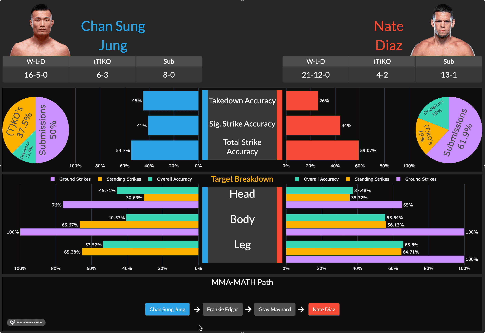

# mma-math-remake
If Fighter A beats Fighter B, and Fighter B beats Fighter C...then Fighter A can beat Fighter C.

**This is the law of mma-math.**

Merging my love of martial arts and data science, 
this project is a remake of a previous [mma-math algorithm](https://github.com/AaronJeeHo/MMA_MATH_PATHFINDER) 
I implemented for a data structures and algorithms class. 

The initial mma-math calculator implements a path finding algorithm that finds the shortest path such that a fighter has
a victory over a fighter who has a victory over another fighter where the path of victories eventually leads 
to the target opponent.


In addition to the path finding algorithm, this remake includes a DASH based GUI that takes in user input and shows 
important statistics and visuals for fighters found in the mma-math path.


&nbsp;
# Running the App
Running `app.py` will run the app
```shell script
python app.py
```

&nbsp;
# Using the App
### Fighter Input
Fighter input is done through the side bar and include suggestions and automatic validation before running the program.
<br/>
<br/>
<p align="center">
 
</p>

&nbsp;
### Challenger Stats
Upon completion, relevant statistics are shown for fighters along the path.

Different stats can be displayed on the fly by clicking different fighters.
<br/>
<br/>



&nbsp;
### Impossible paths and manually stopping search
In the case that a path isn't found, the program will indicate as such in place of a win path.

Furthermore, certain matchups may take a while to find a path. While the app searches for a path, a timer will indicate 
elapsed time in seconds.

The search can be cancelled at any time.
<br/>
<br/>


&nbsp;
# Included Files

## Scrapers

`url_scraper.py`: Scraper that retrieves url's containing fighter data and stores it in /data/urls


`record_scraper.py`: Scraper that retrieves fight records from a fighters page and stores it in /data/fighters


## Scripts
`path_finder.py`: Program that runs a modified Dijkstras algorithm to find shortest win path between
 Fighter A and Fighter B
 
 `stat_finder.py`: Program that retrieves a fighters statistics and data to be visualized
 
 `visual.py`: Program that creates graphs and statistical visualizations using fighter data


&nbsp;
## Credits and Sources
This is a passion project done for non-commerical purposes. I recieved no profit from this app.

All images and statistics are owned by and sourced from [ESPN](http://www.espn.com/mma/fighters)
